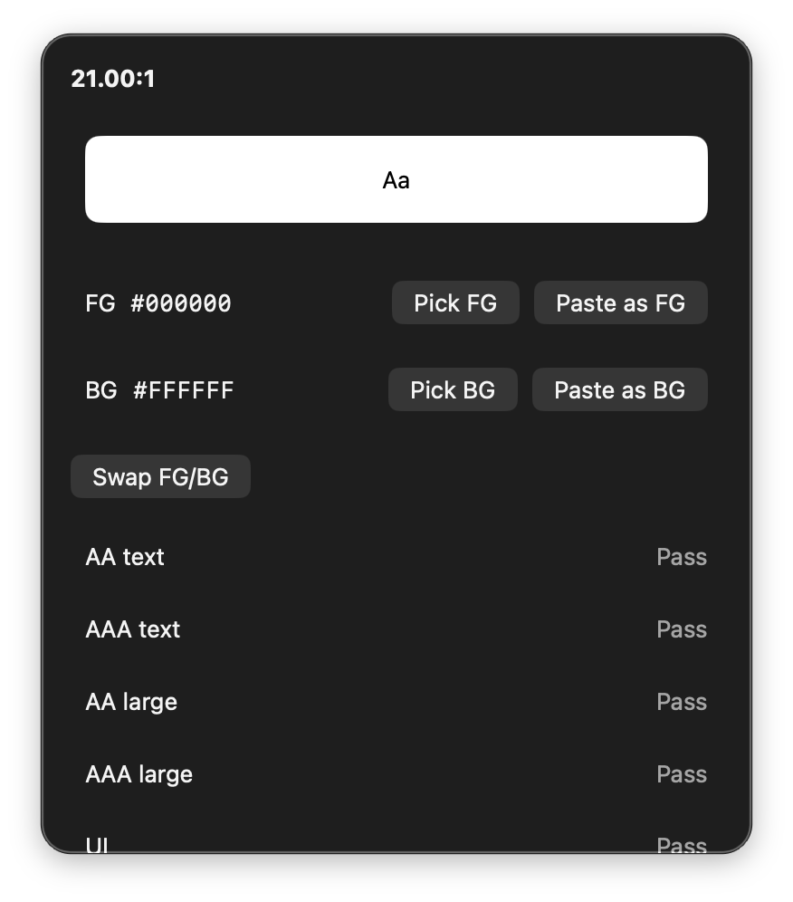

<div align="center">

# Contrast Drop

**Compute WCAG 2.1 contrast for two sRGB colors. Paste `#RRGGBB` or `rgb()`. Copy CSS writes color / background-color.**

Menu extra for macOS 14+. Lives on the **right** of the menu bar. No Dock icon.

<br/>

[](https://github.com/BadryansahBangsawan/contrast-drop/actions/workflows/ci.yml)
[](https://github.com/BadryansahBangsawan/contrast-drop/releases/latest)
[](https://github.com/BadryansahBangsawan/contrast-drop/releases/latest)

<br/>



| | |
|---|---|
| Product | `ContrastDrop` |
| Bundle ID | `engineer.badry.contrastdrop` |
| Status item | SF Symbol `circle.lefthalf.filled` (ratio, e.g. `21.00:1`) |
| Panel | opaque ~360×420 pt |

</div>

---

## What you get

| Piece | Behavior |
|---|---|
| **Pick** | **Pick FG** / **Pick BG** uses the system color sampler, converted to sRGB. |
| **Paste** | **Paste as FG** / **Paste as BG**. The extra does not assign the clipboard on its own. |
| **Parse** | `#RGB`, `#RRGGBB`, `#RRGGBBAA` (alpha dropped), `rgb()`, `rgba()` (alpha dropped), spaces or commas, 0–255 or `%`. |
| **Ratio** | Two decimals. Rows: AA text ≥ 4.5, AAA text ≥ 7, AA large ≥ 3, AAA large ≥ 4.5, UI ≥ 3. |
| **Copy** | **Swap FG/BG**. **Copy CSS**, **Copy FG**, **Copy BG**. |
| **Login** | Open at Login from Settings (`SMAppService`). |

Black on white is `21.00:1` (all Pass). `#777777` on white is about `4.48:1` (AA text Fail).

---

## Download

| File | Use |
|---|---|
| **`ContrastDrop.app.zip`** | Unzip, drag **ContrastDrop** onto **Applications** |

**[Releases](https://github.com/BadryansahBangsawan/contrast-drop/releases/latest)**

---

## Install

### Zip

1. Download `ContrastDrop.app.zip` from [Releases](https://github.com/BadryansahBangsawan/contrast-drop/releases/latest).
2. Unzip. Drag **ContrastDrop** onto **Applications**.
3. First open (ad-hoc signed):

```bash
xattr -cr /Applications/ContrastDrop.app
open /Applications/ContrastDrop.app
```

Still blocked: System Settings → Privacy & Security → Open Anyway.

### Source

```bash
git clone https://github.com/BadryansahBangsawan/contrast-drop.git
cd contrast-drop
bash package-app.sh
ditto dist/ContrastDrop.app /Applications/ContrastDrop.app
xattr -cr /Applications/ContrastDrop.app
open /Applications/ContrastDrop.app
```

Do not run `dist/ContrastDrop.app` while `/Applications/ContrastDrop.app` is running (same bundle ID).

---

## How to open

This is an `LSUIElement` extra. Proof it is running is the **circle.lefthalf.filled** status item on the **right** of the menu bar, not a window from Finder or Launchpad.

1. Click that extra. The panel is opaque ~360×420 pt, not a 10px strip.
2. If the bar is full, look behind the Control Center overflow chevron **«**.
3. Double-clicking in Finder/Launchpad only changes the left-side app name. That is expected. There is no Dock icon.

---

## Usage

1. Click the extra.
2. **Pick FG** / **Pick BG**, or **Paste as FG** / **Paste as BG**.
3. Read the swatch (**Aa**) and the five Pass/Fail rows.
4. **Copy CSS** writes:

```
color: #RRGGBB;
background-color: #RRGGBB;
```

5. **Settings** at the bottom: Open at Login, Quit.

---

## Permissions

No TCC prompts. The sampler is the system color picker, not Screen Recording.

---

## Data

| What | Where |
|---|---|
| Foreground | UserDefaults `engineer.badry.contrastdrop.fg` (`#RRGGBB`) |
| Background | UserDefaults `engineer.badry.contrastdrop.bg` (`#RRGGBB`) |
| Open at Login | `SMAppService.mainApp` (Settings toggle) |

Missing or invalid values reset to `#000000` / `#FFFFFF` and a red **Reset invalid saved color.**

---

## Privacy

No network. Colors stay on this Mac.

---

## Uninstall

Delete `/Applications/ContrastDrop.app`.

This does not delete UserDefaults (`engineer.badry.contrastdrop.fg` / `.bg`).

Turn off **Contrast Drop** in System Settings → General → Login Items if it remains.

---

## Troubleshooting

| What you see | What to do |
|---|---|
| Finder “opens” nothing / no Dock icon | Click the **circle.lefthalf.filled** extra on the right of the menu bar. |
| Extra missing | Overflow **«**, or `pgrep -x ContrastDrop` then `open /Applications/ContrastDrop.app`. |
| “Damaged” / cannot verify | `xattr -cr /Applications/ContrastDrop.app`. `spctl --assess` is `rejected` even when it runs. |
| **Not a hex or rgb color.** | Copy `#RGB`, `#RRGGBB`, or `rgb()` / `rgba()`, then **Paste as FG** / **Paste as BG**. |
| **Color is not convertible to sRGB.** | Sampler color kept the previous value. Pick again. |
| **Reset invalid saved color.** | Saved hex was missing or not `#RRGGBB`. Defaults applied. |
| ~10px empty strip under the bar | Reinstall from this repo. |

---

## Build from source

```bash
git clone https://github.com/BadryansahBangsawan/contrast-drop.git
cd contrast-drop
swift build -c release --product ContrastDrop
bash package-app.sh
open dist/ContrastDrop.app
```

Tag `v*` runs CI: `ContrastDrop.app.zip`. Never commit `dist/`.

Layout: `Sources/` (SwiftPM executable), `Info.plist`, `Assets/AppIcon.icns`, `package-app.sh`. `FunTheme.swift` is copied verbatim (no shared package).

---

## FAQ

**Why is there no Dock icon?**  
It is a menu extra. Click the circle.lefthalf.filled item on the **right** of the menu bar.

**Does the eyedropper need Screen Recording?**  
No. It is the system color sampler.

**Where are the colors stored?**  
UserDefaults `engineer.badry.contrastdrop.fg` and `.bg`. Nothing under Application Support.

**How do I stop it opening at login?**  
Settings in the panel, or System Settings → General → Login Items → **Contrast Drop**.

---

<div align="center">

[MIT](LICENSE)

</div>
